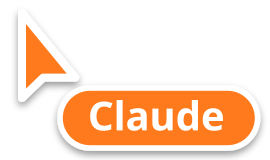

# Omarchy Computer Use

**Claude computer use for Omarchy and Hyprland, with its own cursor.**

Omarchy Computer Use gives Claude (or any MCP-capable agent) a desktop of its own: a
nested Hyprland session that appears on your screen as a single window with an
orange frame. The agent gets its own cursor (an orange arrow with its name
tag), its own keyboard focus and its own windows. Your mouse and keyboard are
never touched, so you keep working while it clicks around. Hide the window and
the agent keeps working in the background.

<p align="center"></p>

- **Your input stays yours.** The agent drives a separate Wayland seat, not your pointer.
- **Real computer use.** It clicks, drags, scrolls, types (including Unicode), presses shortcuts,
  and moves, resizes, maximizes and closes windows.
- **Watch or ignore it.** Show the desktop over your current workspace, or park it off-screen.
  It keeps rendering while hidden.
- **Its own apps.** Browsers get a separate profile and apps get their own D-Bus session,
  so nothing the agent opens lands on your desktop.
- **Take over any time.** While the agent drives, your mouse and keyboard pass over its window
  without touching anything. Take over with one click (the frame turns blue), hand back when done.
  The agent can also hand over by itself, e.g. for a login.
- **Roles.** Decide per agent what it may do: only look, click and type, open URLs from an allowlist,
  launch apps, stop the desktop. Every setting is configurable from the command line.
- **Live preview next to the chat.** Inside [Herdr](https://herdr.dev), a small pane docks next to
  the agent's chat and shows what it sees.
- **No build step.** Plain Python stdlib plus tools Omarchy already ships (`grim`, `wtype`, `wl-clipboard`).

## How it works

```
your Hyprland session
└── window "aquamarine"  (orange frame, 1280×800, parked on a hidden workspace)
    └── nested Hyprland  ← own seat, own cursor, own windows
        ├── virtual pointer  (zwlr_virtual_pointer_v1, spoken directly over the Wayland socket)
        ├── virtual keyboard (wtype)
        └── screenshots      (grim)
```

The nested compositor uses Hyprland's Wayland backend, so it is an ordinary
window on your desktop. Pointer and keyboard events go to the nested
compositor's socket and never reach your session. The host window has
`render_unfocused` set, which keeps the sandbox rendering (and screenshots
working) while it sits on the hidden `agentdesk` workspace.

## Requirements

- Hyprland 0.56 or newer with a Lua config. Omarchy 4 ships this.
- `python3` (3.9+), `grim`, `wtype`
- Optional: `rsvg-convert` to recolour or rename the cursor, and `dbus-run-session`
  to isolate sandbox apps from your session bus

Run `bin/agentdesk doctor` to check.

## Install

### Claude Code plugin

```bash
claude plugin marketplace add enricofranke/omarchy-computer-use
claude plugin install omarchy-computer-use@omarchy-computer-use
```

This installs the MCP server and a `computer-use` skill that teaches Claude
the workflow. To wire up only the MCP server:

```bash
git clone https://github.com/enricofranke/omarchy-computer-use ~/.local/share/omarchy-computer-use
claude mcp add agentdesk -- python3 ~/.local/share/omarchy-computer-use/bin/agentdesk mcp
```

Other MCP clients (Codex, opencode, …) can use the same command:
`python3 /path/to/omarchy-computer-use/bin/agentdesk mcp`.

### Omarchy bar widget

```bash
omarchy plugin add https://github.com/enricofranke/omarchy-computer-use.git --enable --yes
```

A cursor icon appears in the bar. Left click shows or hides the agent's
desktop and starts it when it is stopped. Right click takes over or hands back,
middle click stops it. The icon pulses in the accent colour while the agent is
acting and turns blue while you have taken over.

For a keybinding, add this to `~/.config/hypr/bindings.lua`:

```lua
o.bind("SUPER + CTRL + A", "Agent desktop",
  "python3 ~/.config/omarchy/plugins/io.github.enricofranke.omarchy-computer-use/bin/agentdesk toggle")
```

## Taking over

| | |
|---|---|
| Bar icon | right click takes over / hands back |
| Preview pane | `t` takes over / hands back, `s` shows or hides the window |
| CLI | `agentdesk takeover`, `agentdesk release`, `agentdesk control` (toggle) |

While the agent has control, the sandbox ignores your forwarded mouse and
keyboard and its window does not take your keyboard focus. After a takeover
the agent's input is blocked until you hand back.

## Live preview

`agentdesk watch` draws the desktop in any terminal: a sharp image in Kitty,
Ghostty or WezTerm, coloured half blocks elsewhere. When the agent runs inside
Herdr, the preview opens by itself in a split next to its chat the first time
the desktop starts (`"preview": false` turns that off; `agentdesk preview`
opens it by hand). For a sharp image inside Herdr, enable its experimental
Kitty graphics:

```toml
# ~/.config/herdr/config.toml
[experimental]
kitty_graphics = true
```

## MCP tools

| Tool       | What it does |
|------------|--------------|
| `computer` | `screenshot`, `left_click`, `right_click`, `middle_click`, `double_click`, `triple_click`, `mouse_move`, `left_click_drag`, `left_mouse_down`/`up`, `scroll`, `type`, `key`, `cursor_position`, `wait`, `zoom`. The action set mirrors Anthropic's computer-use tool. Actions return a fresh screenshot. |
| `open`     | Open a URL in the sandbox browser or launch any command inside the sandbox |
| `windows`  | `list`, `focus`, `move`, `resize`, `maximize`, `center`, `fullscreen`, `close` |
| `desktop`  | `status`, `start`, `stop`, `restart`, `show`, `hide`, `handover`, `reclaim`, `preview` |

The desktop starts on first use.

## Command line

The command-line tool and the MCP server are called `agentdesk`.

```bash
agentdesk start [--show|--hidden]   agentdesk stop | restart
agentdesk show | hide | toggle      agentdesk status [--json]
agentdesk open https://example.com  agentdesk open --cmd nautilus
agentdesk screenshot -o shot.png    agentdesk click 640 400 [--button right] [--count 2]
agentdesk type "hello"              agentdesk key ctrl+l
agentdesk scroll 640 400 down 5     agentdesk windows [list|maximize|move|resize|…] [window]
agentdesk takeover | release        agentdesk watch | preview
agentdesk doctor                    agentdesk cursor-preview -o cursor.png
agentdesk config …                  agentdesk role …    agentdesk agents
```

## Configuration

Every setting has a default. Change one with `agentdesk config set`, check what
is in effect with `agentdesk config show`:

```bash
agentdesk config show                    # value and source (default, file, env) of every setting
agentdesk config keys                    # what each setting does
agentdesk config set accent '#7aa2f7'
agentdesk config set kb_layout de
agentdesk config set browser_args -- --lang=de --disable-gpu
agentdesk config unset accent            # back to the default
agentdesk config check                   # validate the file after editing it by hand
agentdesk config edit                    # open it in $EDITOR, validate on close
```

Settings live in `~/.config/agentdesk/config.json`. Every key can also be set
as an environment variable, e.g. `AGENTDESK_ACCENT=#7aa2f7`; lists and objects
as JSON. Environment variables win over the file.

| Key | Default | Meaning |
|-----|---------|---------|
| `width` | `1280` | Sandbox screen width in pixels. Screenshots map 1:1 to click coordinates ¹ |
| `height` | `800` | Sandbox screen height in pixels ¹ |
| `accent` | `#ff7a1a` | Colour of the agent cursor and of the window frame ¹ |
| `takeover_accent` | `#3d9bff` | Frame and bar icon colour while you have taken over |
| `label` | `Claude` | Name tag next to the agent cursor. Empty for a bare arrow ¹ |
| `cursor_size` | `32` | Size of the agent cursor ¹ |
| `frame_width` | `3` | Width of the frame around the sandbox window |
| `background` | `#1e1f29` | Background colour of the sandbox desktop ¹ |
| `rounding` | `8` | Corner radius of windows inside the sandbox ¹ |
| `gaps_in` | `4` | Gap between windows inside the sandbox ¹ |
| `gaps_out` | `8` | Gap between windows and the sandbox edge ¹ |
| `float_windows` | `true` | Windows float and open centred like on a desktop. false tiles them ¹ |
| `kb_layout` | `""` | Keyboard layout inside the sandbox, e.g. de. Empty copies yours ¹ |
| `kb_variant` | `""` | Keyboard layout variant inside the sandbox. Empty copies yours ¹ |
| `start_hidden` | `false` | Park the window off-screen when the desktop starts |
| `workspace` | `agentdesk` | Hidden workspace the window is parked on ¹ |
| `browser` | `""` | Browser for `open` with a URL (Chromium family or Firefox). Empty picks one |
| `browser_args` | `[]` | Extra arguments for the sandbox browser |
| `isolate_dbus` | `true` | Give sandbox apps their own D-Bus session so they open inside the sandbox ¹ |
| `screenshot_cursor` | `false` | Draw the agent cursor into screenshots sent to the agent |
| `settle_ms` | `400` | Pause after an action before the follow-up screenshot, in ms |
| `open_wait_ms` | `2000` | Pause after `open` before the screenshot, in ms |
| `cursor_glide_ms` | `450` | Longest glide of the agent cursor to its target, in ms. 0 jumps |
| `terminal_classes` | `[…]` | Window classes (substrings) that paste with ctrl+shift+v instead of ctrl+v |
| `notify_handover` | `true` | Send a desktop notification when the agent hands control to you |
| `idle_stop_minutes` | `15` | Stop the desktop after this many idle minutes while the agent has control. 0 keeps it running |
| `stop_on_exit` | `true` | Stop a desktop the agent started itself when its session ends |
| `preview` | `true` | Dock a live preview next to the agent's chat when it runs inside Herdr |
| `preview_split` | `auto` | Where the preview docks: right, down or auto (by pane shape) |
| `preview_ratio` | `0.62` | Split ratio handed to Herdr when the preview docks |

Changes apply to running agents on their next action. ¹ Takes effect after `agentdesk restart`.

## Roles

Each agent gets a role that decides what it may do on the desktop. Out of the
box every agent is `admin` and may do everything.

| Role | May |
|------|-----|
| `admin` | everything |
| `operator` | everything except launching commands |
| `viewer` | screenshots, window list and status only |

A role is a list of permissions:

| Permission | Allows |
|------------|--------|
| `screen` | take screenshots, zoom, read the cursor position, list windows, read the desktop status |
| `mouse` | move the cursor, click, drag and scroll |
| `keyboard` | type text and press keys |
| `open.url` | open URLs in the sandbox browser |
| `open.command` | launch commands and apps in the sandbox (they run as your user) |
| `windows.arrange` | focus, move, resize, maximize, center and fullscreen windows |
| `windows.close` | close windows |
| `desktop.start` | start the desktop, also on first use |
| `desktop.stop` | stop the desktop |
| `desktop.show` | show or hide the desktop window and dock the live preview |
| `desktop.handover` | hand control to you, e.g. for a login |
| `desktop.reclaim` | take control back after a handover |

Agents are told their role when they connect. Tools and actions outside it are
not offered, and a call that needs one is refused. Role changes apply to agents
that are already connected.

```bash
agentdesk role list                      # roles, default role, assignments
agentdesk role show operator             # one role, permission by permission
agentdesk role default operator          # role for agents without an assignment
agentdesk agents                         # agents that connected, by client name, and their role
agentdesk role assign claude-code operator
agentdesk role assign 'codex*' viewer    # client names can be globs
agentdesk role unassign claude-code
```

Custom roles can also limit which URLs and programs `open` may start:

```bash
agentdesk role set tester --from operator --description "web testing" \
  --urls 'https://staging.example.com/*' --commands nautilus
agentdesk role deny tester desktop.stop windows.close
agentdesk role allow tester open.command
agentdesk role remove tester             # custom roles; built-in ones reset to their defaults
```

Permissions accept globs (`open.*`, `desktop.*`). A command limit only accepts
plain commands, without shell syntax such as `;`, `&&`, `|` or `$(…)`.

The role is picked in this order: `agentdesk mcp --role NAME` (or
`AGENTDESK_ROLE`) in the MCP server command, the agent's entry in `agents`,
then `default_role`. An unknown role blocks every tool.

## Security

Omarchy Computer Use isolates **input and display**. It is not a security
sandbox. Apps inside it run as your user and can read and write your files. The
sandbox browser profile starts empty, so the agent is not logged in anywhere
unless you log in for it.

Roles limit what the agent can do **through the MCP tools**. They are
guardrails, not a security boundary. An agent that also has a shell as your
user, like Claude Code with its Bash tool, can edit the config file or run the
`agentdesk` command line. A URL limit only covers `open`: an agent with the
`keyboard` permission can still type an address into the browser. For hard
limits, take away the agent's shell access too.

## Troubleshooting

- **Screenshots time out.** The window is somewhere the host stopped drawing,
  such as a closed special workspace. The desktop parks itself automatically and
  retries; `agentdesk hide` does the same by hand.
- **The window was closed.** The nested session ends with it. The next action
  or `agentdesk start` brings up a fresh one.
- **Logs.** `$XDG_RUNTIME_DIR/agentdesk/hyprland.log`

## License

MIT
